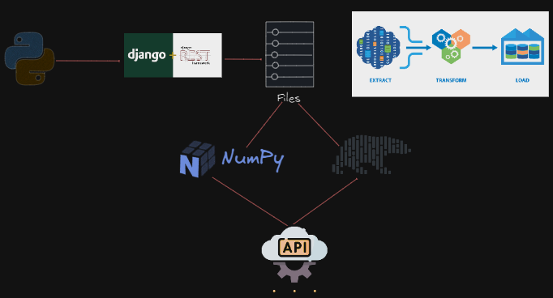

# API de Procesos ETL 🛠️✨

## Descripción

¡Bienvenido a la API de Procesos ETL, donde Django y DRF aceleran la manipulación de datos donde Polars y NumPy son las estrellas detrás del show! 🚀. Esta API está diseñada para manejar grandes volúmenes de datos y transformarlos a tu medida con eficiencia y estilo. 🛠️📊

## Síguenos a Través de Estos Pasos

**No olvides crear tu entorno virtual**

1. **Preparativos:**
   Asegúrate de tener Python y Docker instalados en tu sistema.
2. **Configuración de la Base de Datos:**
   Configura las variables de entorno en el archivo `.env.template` y cambia el nombre por `.env` para la conexión a PostgreSQL.
3. **Instalación de Dependencias:**
   Ejecuta `python -m pip install -r requirements.txt` para instalar las dependencias necesarias (incluyendo Django, DRF, Pandas, NumPy y Polars).
4. **Ejecutar en Docker:**
   Inicia los contenedores de Docker usando `docker-compose up -d`.
5. Levanta el proyecto utilizando `uvicorn main:app --reload`.

## Ruta Admin

### **¡SEED Mágico! 🌱**

¡Inicia tu aventura de procesamiento de datos cargando archivos y ejecutando transformaciones mágicas!

#### 🗃️ Subir El Archivo Excel de Direcciones

- **Método:** `POST`
- **Ruta:** `/api/v1/upload/address/`
- **Descripción:** Sube archivos 1 en formato Excel y prepárate para llenar la base de datos de información.
- **Observación:**: A este archivo lo vas a poder encontrar en el directorio
  `📂 address/`

**Obtener Direcciones** 📈

- **Método:** `GET`
- **Ruta:** /api/v1/address/
- **Descripción:** Consulta los datos de direcciones en este proceso ETL.

- **Método:** `GET`
- **Ruta:** /api/v1/address/{id}/
- **Descripción:** Consulta los datos de direcciones por medio del id en este proceso ETL.

- **Método:** `GET`
- **Ruta:** /api/v1/address/parroquia/{parroquia_name}/
- **Descripción:** Consulta los datos de direcciones por medio del nombre de la parroquia en este proceso ETL.

- **Método:** `PUT`
- **Ruta:** /api/v1/address/
- **Descripción:** Editar los datos de direcciones en este proceso ETL.

- **Método:** `POST`
- **Ruta:** /api/v1/address/
- **Descripción:** Crear por medio de un formular los datos de direcciones.

- **Método:** `DELETE`
- **Ruta:** /api/v1/address/
- **Descripción:** Eliminar los datos de direcciones en este proceso ETL.

**Obtener Teams**

- **Método:** `GET, POST, PUT, DELETE`
- **Ruta:** `/api/v1/teams/`
- **Descripción:** Filtra, agrupa y transforma datos como un hechicero usando el poder de Pandas. Aplica operaciones mágicas como media, mediana, y más.

## 🔐 Acceso Mágico a la API

Descubre los procesos que podemos realizar en ML

## Acceder al Portal de Login 🔑

- **URL:** localhost:8000/api/v1/login
- **Descripción:** Protege tus datos mágicos accediendo a través del portal seguro de autenticación.

## Registro de Nuevos Usuarios ✍️

- **URL:** localhost:8000/api/v1/register/
- **Descripción:** Regístrate para comenzar a realizar procesos ETL mágicos. ¡El conocimiento del procesamiento de datos está a tu alcance!

## Revisa el Perfil de Usuarios ✍️

- **URL:** localhost:8000/api/v1/profile/
- **Descripción:** Revisa el Perfil de cada Usuario

## Cerrar Session ✍️

- **URL:** http://127.0.0.1:8000/api/v1/logout/
- **Descripción:** Cerrar la session del Usuario

### 🔮 Procesar Datos - Transformaciones con Polars

**A continuación te detallare paso a paso cada url de la API, pero si te quieres saltar, pues...**

Esto te permitira ver todas las urls del proyecto:

- **Comando:** `python .\manage.py show_urls`

**Sigamos...**

### ⚡ Servidor de Archivos

- **Método:** `GET, POST, PUT, DELETE`
- **Ruta:** `/api/v1/agronomicos`
- **Descripción:** ¡Aprovecha la potencia de DRF para subir archivos sin perder un segundo!

**📦 Descargar Archivos**

- **Método:** `GET`
- **Ruta:** `/api/v1/agronomicos/download/{file_name}/`
- **Descripción:** Abre tus datos directamente en el navegador para poderlos descargar.

> Sigue exlorando por cada una de las carpetas, pues el proyecto esta dentro de src, hasta llegar a Spectral

### 🔢 Operaciones Matemáticas con NumPy y Procesar datos con polars

**Spectral**

- **Método:** `POST`
- **Ruta:** `/api/v1/upload/`
- **Descripción:** ¡Aprovecha la potencia de DRF para subir el archivo de firmas espectrales sin perder un segundo!

- **Método:** `GET`
- **Ruta:** `/api/v1/info/`
- **Descripción:** Revisar la información de todas las firmas esectrales

- **Método:** `GET, PUT, DELETE`
- **Ruta:** `/api/v1/info/{id}`
- **Descripción:** Revisar la información de una de las firmas esectrales

- **Método:** `GET`
- **Ruta:** `/api/v1/data/`
- **Descripción:** Revisar la data de todas las firmas esectrales

- **Método:** `GET, PUT, DELETE`
- **Ruta:** `/api/v1/data/{id}`
- **Descripción:** Revisar la data de una de las firmas esectrales

---

### Descubre nuestros procesos ETL🌟

**WEB**

- **Método:** `GET`
- **Ruta:** `https://colab.research.google.com/drive/1RluuKh9Pv81Wkx1uqQ_M7TRf658tlTFh?hl=es#scrollTo=nlo87x4HG4MU`
- **Descripción:** ¡Descubre los procesos iniciales que llevo a crear la API!

**DIRECTORY**
`📂 data/etl/`

## 📊 Explora el Modelo ER

Para entender cómo fluye la magia entre las entidades, puedes visualizar el Modelo ER de la base de datos en la carpeta:

`📂 er/db/`

## 📊 Diagrama ETL

Este diagrama te dará una visión clara de cómo es el flujo para realizar las transformaciones ETL de manera eficiente 💡.

## 📚 Documentación API Interactiva

Descubre la magia de cada endpoint y prueba la API con nuestra **Documentación interactiva**.
¡Realiza pruebas, ajusta transformaciones y experimenta con el poder de Django REST FRAMEWORK! 🌟

**Doc:** OPEN API

- **Método:** `GET`
- **Ruta:** `/api/v1/docs/`

**Doc:** Redoc

- **Método:** `GET`
- **Ruta:** `/api/v1/redoc/`

---

Para que corra el proyecto en local o Producción debe seguir los siguientes comandos
👁️, use git bash

- Escriba en la terminal: `export DJANGO_SETTINGS_MODULE=core.settings.dev`
- Seguido de: `py manage.py runserver`
  Pues este proyecto ya está listo para producción😄

- Escriba en la terminal: `export DJANGO_SETTINGS_MODULE=core.settings.prod`
- Seguido de: `py manage.py runserver`

**Seguido de:** `python manage.py runserver`
